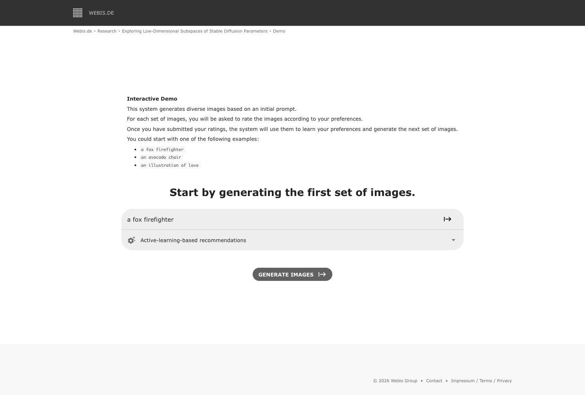
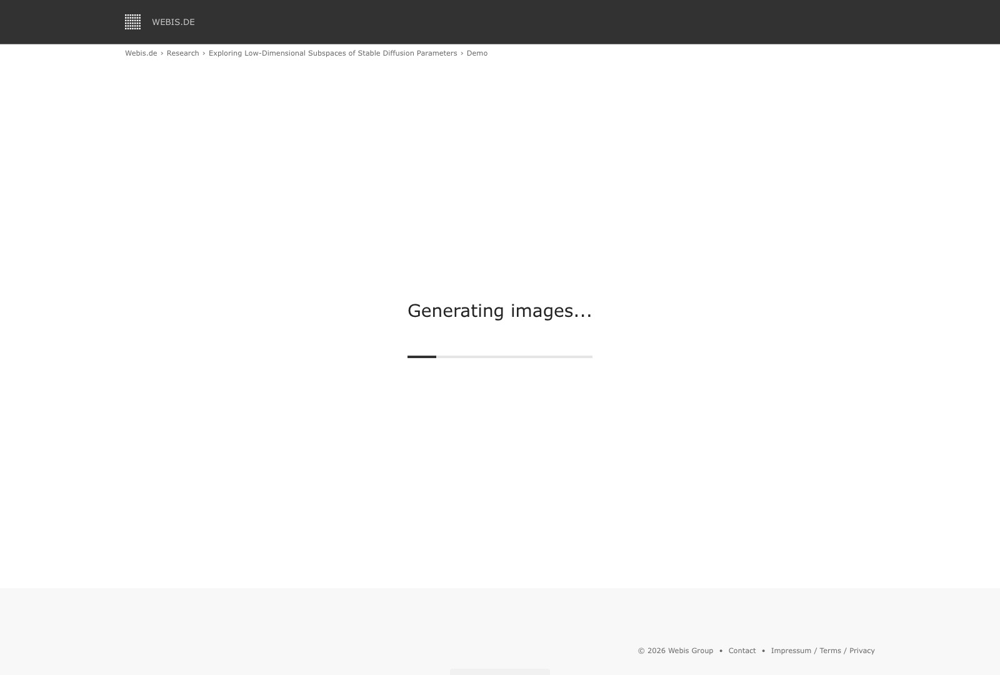
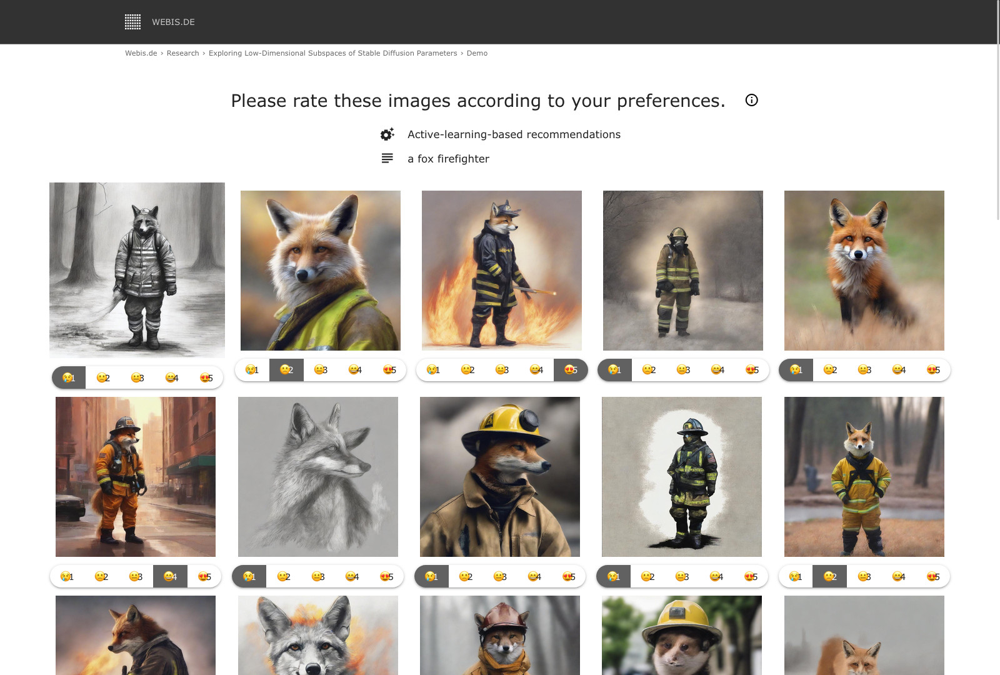
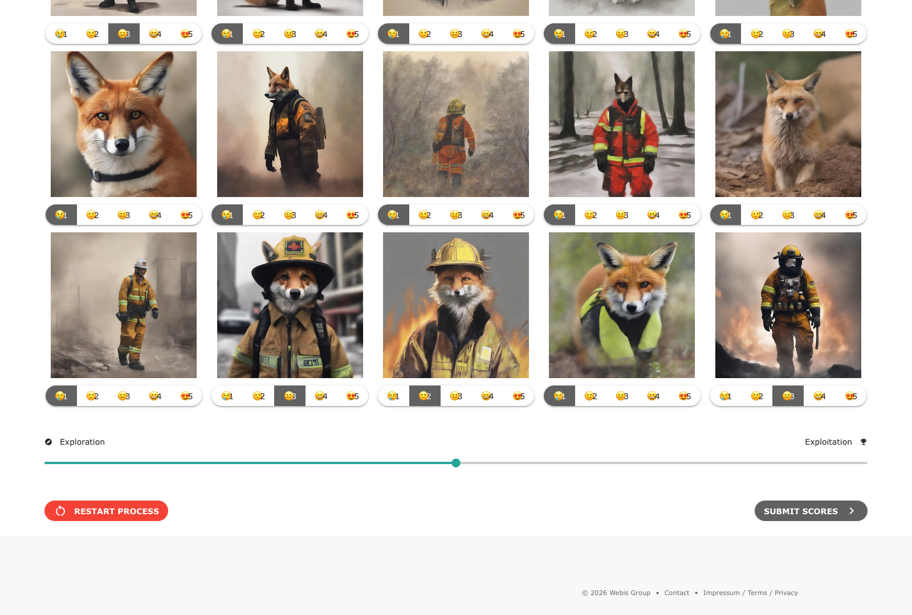

# Exploring Low-Dimensional Subspaces of Stable Diffusion Parameters

This repository provides a web UI to demonstrate the methods described in our paper `Exploring Low-Dimensional Subspaces of Stable Diffusion Parameters` (currently under review). It uses Stable Diffusion XL to generate images based on an initial prompt, which can then be refined via user feedback (without manual prompt engineering).

## Deployment

Our demo is deployed on our own server and can be accessed under the following URL: [https://exploring-sd-parameters.web.webis.de/](https://exploring-sd-parameters.web.webis.de/)

## Functionality

The following screenshots demonstrate the functionality of the web UI:


*Initially, the user enters a prompt and specifies the method that will be used to search for recommendations: `Active-learning-based recommendations` or `Stepwise movement through the parameter space`. Examples prompts are given.*


*The software generates an initial set of images.*


*For each of the generated images, the user can give a rating by clicking a corresponding emoji. Alternatively, keyboard input is possible.*


*Once the user has finished editing, they can submit the ratings, which will lead to another iteration of images that can then be rated again. By default, the method moves from exploration towards exploitation over a span of multiple iterations. This behavior can be adjusted using a slider.*


## Installation

We provide a `Dockerfile` that contains the required installation steps. If you want to install the required packages
manually via python, use the following command:

```
pip3 install -r requirements.txt
```

Alternatively, we provide a [pre-built container image](https://github.com/niklasdeckers/exploring-sd-parameters/pkgs/container/exploring-sd-parameters).

## Usage

A configuration file can be found under `configs/config.yaml`.

The web UI can be deployed using the following command:

```
python3 main.py
```

The web UI will be hosted under the port specified in the config.

It is recommended to run the backend using CUDA on a 10 GB GPU. Our deployment runs on a MIG partition of an
NVIDIA A100 GPU.
